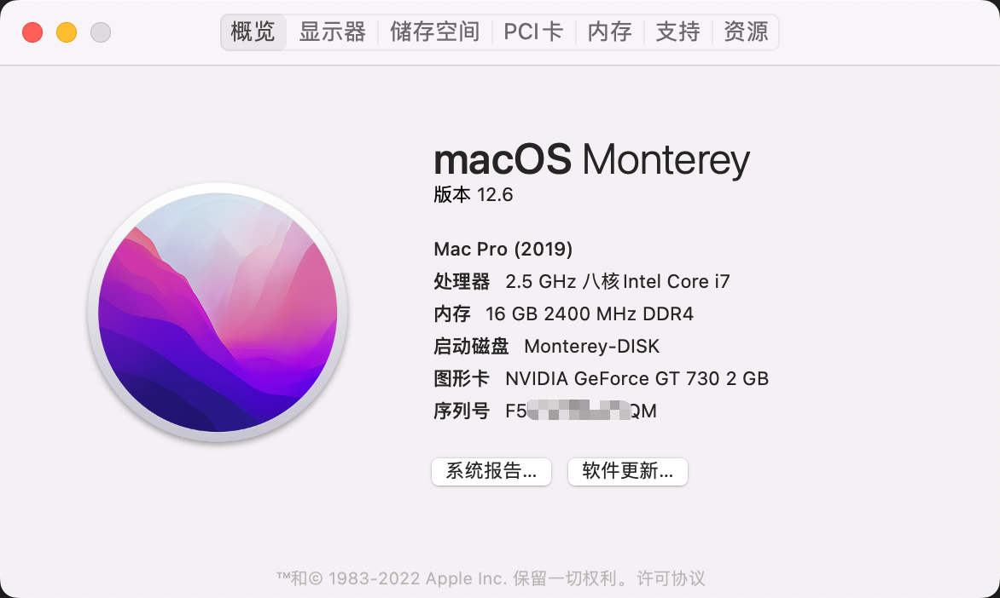

# Hackintosh-OptiPlex-7090MT

**Opencore Bootloader 0.8.4. Tested on Monterey 12.6**

## Introdution
You will have to [**generate a new SMIBIOS**](https://github.com/corpnewt/GenSMBIOS) before login to your iCloud account.

## Hardware Specs
* **Desktop Computer**: Dell OptiPlex 7090 MT
* **CPU**:  Intel® Core™ i7-11700 (8 cores, 2.5GHZ)
* **iGPU**: Intel® UHD Graphics 750
* **MotherBoard**: Dell 0GNVHC (LPC Controller - 4384)
* **GPU**: NVIDIA GeForce GT 730 2GB
* **RAM**: Micro 16GB DDR4 2400
* **HDD**: KBG40ZNS256G NVMe KIOXIA 256GB(M.2)
* **LAN**: Intel I219-LM
* **Wi-Fi & Bluetooth**: USB 蓝牙

## Working
* Internal Speaker / Front panel headphone out / Back panel lineout
* USB Ports (2.0 and 3.0)
* 10G LAN & Wireless Network & bluetooth

## Not working
* Airdrop / Airplay /  Handoff (Not support for Intel AX210)
* Sidecar (needs T2 chip)
* DRM Content in Safari (needs T2 chip)

## USB Mapping
USB ports map:

USB ports in hackintool:

Other details:

* HS12 and HS13 are disabled due to the MacOS USB ports limit.
* Since I don't have a typeC device, the typeC port is not test (I guess is SS01 and HS02)

## Reference
* https://github.com/webleon/Hackintosh-OptiPlex-7080-MT
* https://github.com/ian7yang/ASUS-B560m-Plus-WiFi-i7-11700K
